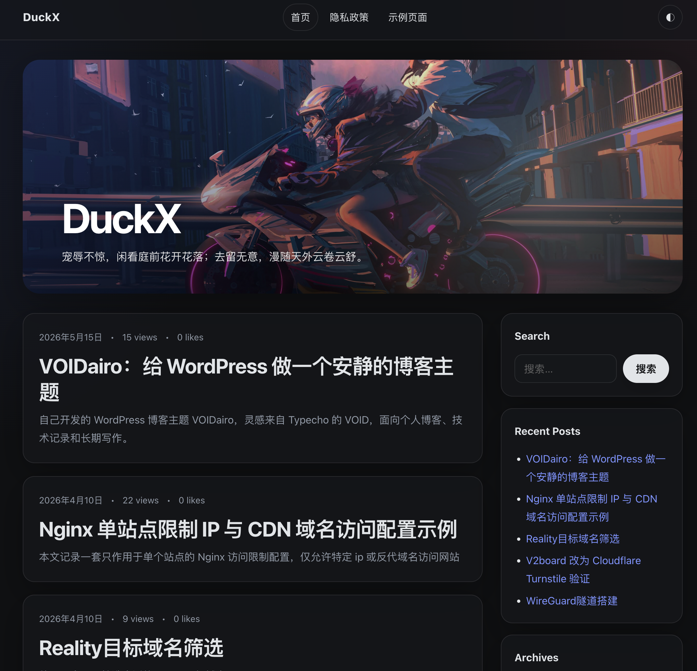

# VOIDairo

VOIDairo 是一个从零编写的 WordPress 博客主题：视觉方向参考 VOID 的简洁、留白、阅读体验和功能组织；文章列表里有特色图的文章使用 Sakurairo 风格的封面悬浮动效。主题没有复制 VOID 或 Sakurairo 的代码。



## 预览

- 正在使用 VOIDairo 的网站：[DuckX](https://www.duckx.top)

## 特性

- WordPress 标准主题结构，可直接放入 `wp-content/themes/voidairo`。
- VOID 风格：安静留白、阅读优先、归档模板、写作增强、日夜模式、衬线阅读字体可选。
- Sakurairo 风格封面动效：特色图放大、轻微旋转、跟随鼠标光斑、毛玻璃标题层、从封面采样主题色。
- 后台 `外观 → VOIDairo 设置`：PJAX、AJAX 评论、TOC、点赞、阅读量、Mac 风格代码块、衬线字体、深色模式、元信息显示排序、手动检查/更新主题。
- SEO：title-tag、canonical、meta description、Open Graph、Twitter Card、WebSite/BlogPosting JSON-LD。
- 性能：无 jQuery、无构建依赖、JS defer、图片 lazy loading、content-visibility、IntersectionObserver。
- 响应式菜单、侧栏、小工具、评论、深色模式。

## 安装使用

1. 前往 [Releases](https://github.com/viuku/voidairo/releases) 下载最新版本的主题压缩包。
2. 登录 WordPress 后台，进入 `外观 → 主题 → 添加新主题 → 上传主题`。
3. 选择下载好的 `voidairo-*.zip` 文件，点击安装并启用。
4. 启用后可在 `外观 → VOIDairo 设置` 中调整 PJAX、AJAX 评论、TOC、点赞、阅读量、深色模式、元信息排序等选项。

## 写作增强

```text
[notice type="info" title="提示"]提示内容[/notice]

[photos]
[photo src="https://example.com/photo.jpg" alt="图片说明" caption="图片标题"]
[/photos]

[links]
[link title="站点名" url="https://example.com" desc="一句简介" image="https://example.com/avatar.png"]
[/links]

{{文字:注音}}
[ruby text="文字" rt="注音"]
[ruby]文字:注音[/ruby]
```

## Archives 页面模板

新建一个 WordPress 页面，在页面模板里选择 `Archives`，即可生成按年份分组的归档页。

## License

GPL-2.0-or-later
